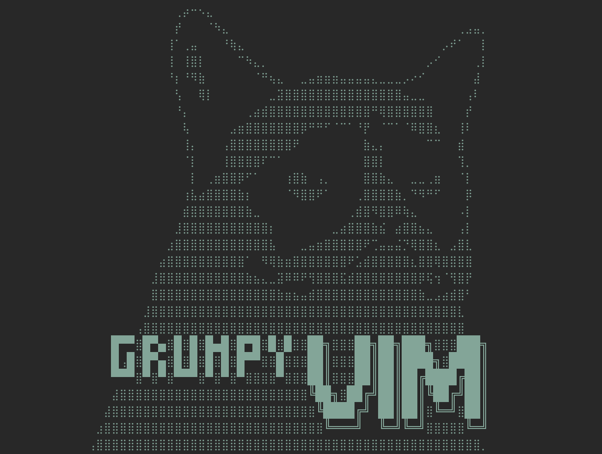

<p align="center">
  
</p>

# Grumpyvim

A personalized Neovim configuration built on [LazyVim](https://www.lazyvim.org/).

This is the successor to the original grumpyvim, rebuilt on top of the LazyVim distribution for easier maintenance and better community support.

## Features

- **LazyVim base** - Sensible defaults, active maintenance, and easy updates
- **Gruvbox dark theme** - Classic, easy-on-the-eyes colorscheme
- **Full-stack development** - TypeScript, Python, Go, Svelte, Tailwind support
- **Fast navigation** - fzf-lua for fuzzy finding, Harpoon for file marks
- **Git integration** - LazyGit TUI + vim-fugitive for quick commands
- **Kitty terminal** - Seamless navigation between Neovim and Kitty splits

## Requirements

- macOS (tested) or Linux
- [Homebrew](https://brew.sh/) (for dependency installation)
- [Kitty](https://sw.kovidgoyal.net/kitty/) or [iTerm2](https://iterm2.com/) terminal
- [Nerd Font](https://www.nerdfonts.com/) for icons

## Installation

### Quick Install

```bash
# Clone the repository
git clone https://github.com/edylim/grumpyvim ~/.config/grumpyvim

# Run the install script
cd ~/.config/grumpyvim
chmod +x install.sh
./install.sh
```

### Manual Install

```bash
# Install dependencies
brew bundle --file=Brewfile

# Backup existing config (if any)
mv ~/.config/nvim ~/.config/nvim.backup

# Symlink grumpyvim
ln -s /path/to/grumpyvim ~/.config/nvim

# Launch Neovim (plugins install automatically)
nvim
```

## Key Bindings

Leader key: `Space`

### Quick Actions

| Key         | Action                  |
| ----------- | ----------------------- |
| `jj`        | Escape from insert mode |
| `<leader>q` | Quit Neovim             |
| `<leader>?` | Show all keymaps        |

### Project/Files (`<leader>p`)

| Key             | Action                   |
| --------------- | ------------------------ |
| `<leader><tab>` | Toggle previous file     |
| `<leader>pt`    | Toggle file tree         |
| `<leader>pf`    | Find file                |
| `<leader>pr`    | Recent files             |
| `<leader>pb`    | Show buffers             |
| `<leader>pp`    | Select project           |
| `<leader>/`     | Search in project        |
| `<leader>pw`    | Search word under cursor |

### Windows (`<leader>w`)

| Key           | Action          |
| ------------- | --------------- |
| `<leader>w\|` | Split right     |
| `<leader>w-`  | Split below     |
| `<leader>we`  | Equalize sizes  |
| `<leader>wd`  | Close window    |
| `<leader>wm`  | Maximize toggle |
| `<leader>ws`  | Save session    |
| `<leader>wr`  | Restore session |

### Tabs (`<leader>t`)

| Key          | Action       |
| ------------ | ------------ |
| `<leader>t`  | Tab picker   |
| `<leader>tn` | New tab      |
| `<leader>td` | Close tab    |
| `<leader>tl` | Next tab     |
| `<leader>th` | Previous tab |

### LSP (`<leader>l`)

| Key          | Action           |
| ------------ | ---------------- |
| `<leader>ld` | Go to definition |
| `<leader>lr` | References       |
| `<leader>li` | Implementations  |
| `<leader>lt` | Type definition  |
| `<leader>la` | Code actions     |
| `<leader>lR` | Rename symbol    |
| `<leader>le` | Diagnostics      |
| `<leader>lD` | Hover docs       |

### Git (`<leader>g`)

| Key          | Action       |
| ------------ | ------------ |
| `<leader>gg` | Open LazyGit |
| `<leader>gs` | Git status   |
| `<leader>gb` | Git blame    |
| `<leader>gd` | Git diff     |

### Harpoon (`<leader>h`)

| Key            | Action           |
| -------------- | ---------------- |
| `<leader>ha`   | Add file mark    |
| `<leader>hs`   | Show marks       |
| `<leader>hh`   | Previous mark    |
| `<leader>hl`   | Next mark        |
| `<leader>h1-4` | Jump to mark 1-4 |

### Utility (`<leader>u`)

| Key          | Action           |
| ------------ | ---------------- |
| `<leader>uh` | Clear highlights |
| `<leader>us` | Source file      |
| `<leader>uL` | Restart LSP      |

### Format (`<leader>m`)

| Key          | Action                |
| ------------ | --------------------- |
| `<leader>mp` | Format file/selection |

## Structure

```
grumpyvim/
├── init.lua              # Entry point
├── lua/
│   ├── config/
│   │   ├── lazy.lua      # Plugin manager + LazyVim setup
│   │   ├── options.lua   # Vim options
│   │   ├── keymaps.lua   # Custom keybindings
│   │   └── autocmds.lua  # Autocommands
│   └── plugins/
│       ├── colorscheme.lua   # Gruvbox theme
│       ├── editor.lua        # Editor plugins
│       ├── lsp.lua           # LSP configuration
│       ├── formatting.lua    # Formatters
│       ├── ui.lua            # UI customizations
│       ├── git.lua           # Git plugins
│       └── disabled.lua      # Disable unwanted defaults
├── static/
│   └── grumpy-vim.png
├── Brewfile
├── install.sh
└── README.md
```

## Updating

Grumpyvim is built on LazyVim, so updates are easy:

```vim
:Lazy update
```

This pulls the latest LazyVim improvements while keeping your customizations intact.

## Customization

- **Add plugins**: Create a new file in `lua/plugins/` with your plugin specs
- **Change options**: Edit `lua/config/options.lua`
- **Add keymaps**: Edit `lua/config/keymaps.lua`
- **Disable LazyVim defaults**: Add entries to `lua/plugins/disabled.lua`

## Language Support

Pre-configured LSP support for:

- TypeScript/JavaScript (ts_ls, ESLint)
- Python (pyright)
- Go (gopls, templ)
- Svelte
- Tailwind CSS
- HTML/CSS
- GraphQL
- Lua

## Differences from Original Grumpyvim

| Feature        | Old Grumpyvim | Grumpyvim (current) |
| -------------- | ------------- | ------------------- |
| Base           | Custom        | LazyVim             |
| Plugin Manager | lazy.nvim     | lazy.nvim           |
| File Explorer  | nvim-tree     | neo-tree            |
| Fuzzy Finder   | Telescope     | Snacks.picker       |
| Completion     | nvim-cmp      | blink.cmp           |
| Comments       | Comment.nvim  | ts-comments         |
| Session        | auto-session  | persistence.nvim    |
| Dashboard      | alpha-nvim    | snacks.dashboard    |

## Credits

- [LazyVim](https://www.lazyvim.org/) - The excellent Neovim distribution this is built on
- [folke](https://github.com/folke) - Creator of lazy.nvim and LazyVim
